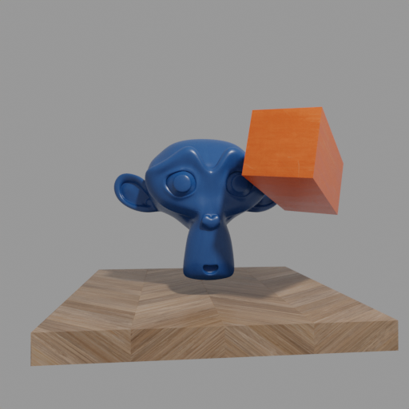

# Distracted Dataset

This repo is part of a project for the ADL4CV: Visual Computing course at the Technical University of Munich (TUM).
It is used to generate a dataset which contains a distractor object and an identical copy which does not contain any distractors.
This dataset can be loaded with the sdfstudio dataparser: https://github.com/DavidRisch/robust_sdfstudio/blob/master/nerfstudio/data/dataparsers/sdfstudio_dataparser.py

Project page: https://davidrisch.github.io/robust_sdfstudio/

## Usage

- Install `blenderproc==2.5.0`.
- Run `python3 scripts/run.py --sceneName suzanne --kind all --resolution all`
  with the environment variable `DATASET_DIR` set to the path of an empty directory into which the dataset will be exported.

## Acknowledgments

The textures contained in `ressources/` are provided by https://ambientcg.com under the Creative Commons CC0 1.0 Universal License.
